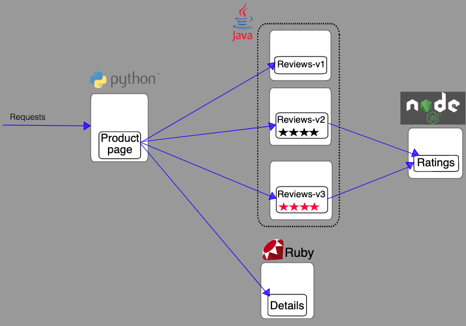

# Hash Teste Infrastructure developer

Antes de começar, leia os nossos [key values](https://www.keyvalues.com/hash) para entender um pouco sobre o que nós priorizamos no desenvolvimento e faça o seu melhor, pois iremos avaliar o teste como se fosse seu melhor esforço ;)


O desafio é baseado nos serviços do diretório [./services](./services) leia-os antes de prosseguir.
Com base nesses serviços avalie como você faria para automatizar o release e o deploy dos mesmos em um cluster Kubernetes.

Envie o resultado do seu desafio para sre@hash.com.br (ele pode ser open source!). Em até uma semana marcaremos uma conversa com você após analisarmos seu desafio.

## Tasks e restrições

* Crie um pipeline CI/CD para fazer o deploy dos serviços do diretório ./services, você pode usar qualquer ferramenta de CI.
    * As aplicações **devem** ter steps de build, testes e deploy em Kubernetes
    * O desafio **deve** ser feito usando “Pipeline as code"
    * O pipeline de deploy **precisa*** validar que o mesmo foi concluído com sucesso, caso contrário o mesmo deve falhar
    * **Se** possível, padronizar o processo de build das aplicações
    * O pipeline **precisa** conter no minímo dois ambientes (dev/prod)
* Provisione uma RBAC de acesso ao cluster para um possível acesso de um desenvolvedor queira ter ao serviços desenvolvidos
    * O Cluster de Kubernetes **deve** ter acesso aos recursos gerenciados via RBAC, levando em consideração a idéia de mínimo privilégio
* Plus:
    * Crie em forma modularizada e use o principio do DRY
    * Abstraia de forma que seja possível um desenvolvedor criar novos fluxos de forma fácil com poucos parâmetros ou em um arquivo de config.

## Como avaliaremos seu teste técnico

* O quão reprodutível isso é, ou seja o quão fácil será reproduzir isso internamente
* O quão automatizado está, ou seja quais são os passos pra eu colocar essa solução no ar? Quantos passos manuais eu preciso executar?
* O quão bem documentado está
* Levamos segurança a sério, avaliaremos o quão segura é a solução
* Discutiremos como esse sistema evoluiria ao longo do tempo
* Considere que mais pessoas irão trabalhar junto com você nesse projeto
* Conversaremos sobre a estrutura do desafio, escolha de ferramentas, e outras decisões que foram tomadas


## Serviços

Sinta-se livre para melhorar qualquer aspecto dos serviços como: Dockerfiles, criar testes, consertar problemas no código caso os identifique, etc.

O diretório [./services](./services) consiste em quatro microserviços que compôem uma aplicação de informações sobre um livro, como um catalógo de livros online.

Os serviços que compôem a aplicação são:
- productpage (Chama details e reviews para popular a página de informações)
- details (Contém informação sobre um livro)
- reviews (Contém avaliações de um livro. Também chama o serviço ratings)
- ratings (Contém o ranking do livro)

Bancos:
- mongodb
- mysql


Diagrama simples(não cobre os bancos, apenas as chamadas de serviço)




#### Algumas considerações:

- O serviço `reviews` não contém um Dockerfile unificado, para conseguir fazer o build talvez você tenha que rodar um:

```bash
  docker run --rm -u root -v "$(pwd)":/home/gradle/project -w /home/gradle/project gradle:4.8.1 gradle clean build
```

Depois disso poderá fazer o docker build no diretório `reviews-wlpcfg`
